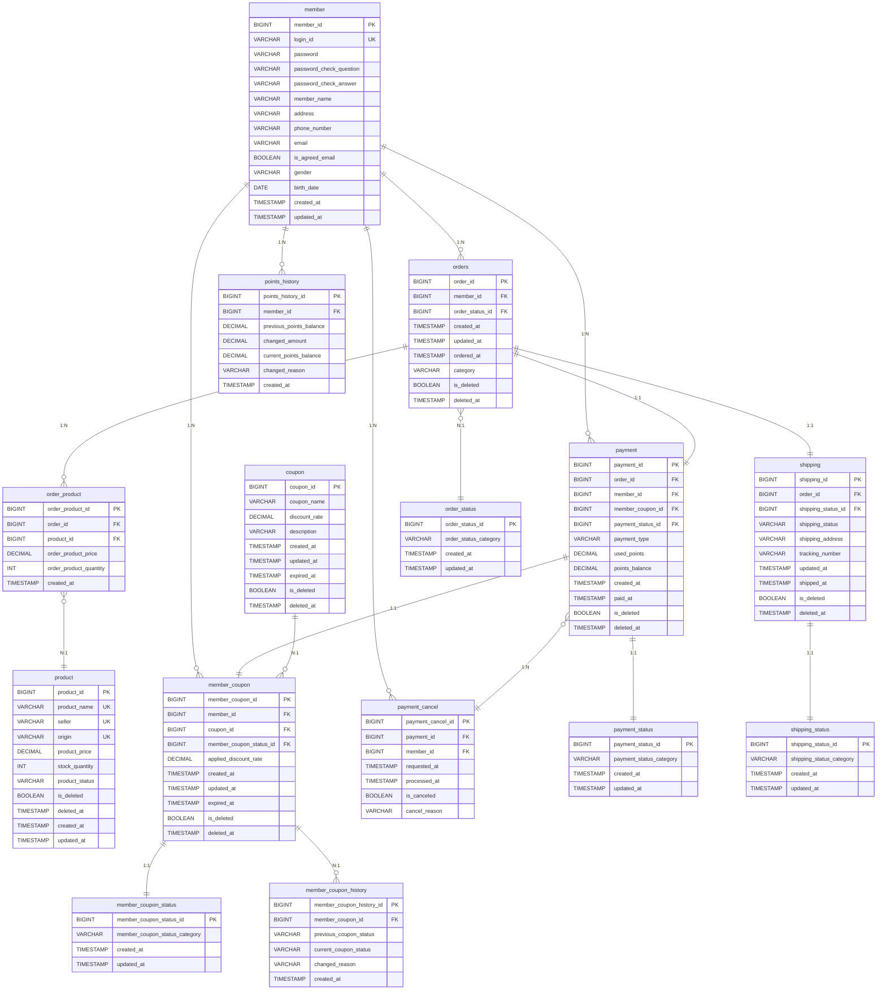

  

   

"자연산 송이의 모든것!"  강원송이총판 쇼핑몰을 클론코딩한 API 서버 토이 프로젝트입니다.

 
 

### 🍄 단순히 쇼핑몰 기능만 구현하지 않았습니다!
* 실제 서비스로 이어지기까지 어떤 과정을 거치는지
* 유지보수성을 위한 객체지향적 설계는 어떻게 이루어져야 하는지
* 냄새나는 코드를 제거해서 읽기 좋은 코드를 만들기 위해서는 어떻게 해야 하는지

대용량 트래픽에도 장애 없이 동작할 수 있도록 성능과 유지보수성을 고려한 서비스를 만들기 위해서, 읽기 좋은 코드, 객체지향적 설계를 위해 노력하였습니다.

 
 

### 🍄 프로젝트 전체 구성도

 
 

### 🍄 테이블 ERD
- [테이블 정의서](https://docs.google.com/spreadsheets/d/15J84XUVwE1L5zgDj9VnxLLhqDx1wBpXzy57Fg623Rrg/edit?usp=sharing)

